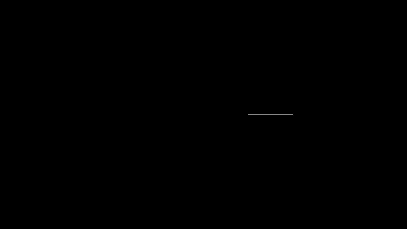

## 人工智能基础 | 神经网络动画化

*The Basics of Artificial Intelligence / Animation of Neural Networks*

---

## 项目简介

本项目旨在动画化「人工智能基础」课程的神经网络部分。本项目基于 ManimML 构建，围绕单个神经元在网络中的表现、多个隐藏层在网络中的效果，以及特定的如 CNN、RNN 模型的应用进行动画化。

*This project aims to animate the neural network section of the "Fundamentals of Artificial Intelligence" course. It is built on ManimML and focuses on animating the behavior of single neurons in the network, the effects of multiple hidden layers within the network, and the applications of specific models such as CNN and RNN.*

---

## 项目内容

### Basic

#### 1 单个神经元与激活函数

- 本动画展示了权重在神经元上的影响，揭示了激活函数如何决定神经元的响应。

  *This animation demonstrates the impact of weights on a neuron, revealing how the activation function determines the neuron's response.*

  

#### 2 多层感知机 (MLP) 的基本结构

- 本动画呈现了 MLP 的基本结构，深入探索其层级、神经元连接和工作原理。

  *This animation presents the basic structure of the MLP, delving into its layers, neuronal connections, and working principles.*

  

#### 3 基于 MNIST 的手写数字识别

- 本动画展示了基于 MNIST 数据集的手写数字识别过程，揭示了从输入到分类的精确机制。

  *This animation shows the process of handwritten digit recognition based on the MNIST dataset, revealing the precise mechanism from input to classification.*

  

---

### Optimizer

#### 4 神经网络 (NN) 的训练过程

- 本动画展示了神经网络的训练过程，展示了神经网络的万能性。

  *This animation displays the training process of NNs, covering every step from data input to output.*

  

#### 5 梯度下降的优化策略

- 本动画呈现了梯度下降作为优化策略的过程，以及它如何有效地指导神经网络达到最佳性能。

  *This animation presents the process of gradient descent as an optimization strategy, and how it effectively guides neural networks to peak performance.*

  

#### 6 梯度消失的解决方案

- 本动画展示了梯度消失问题及其常见的解决方案。

  *This animation shows the issue of gradient vanishing and its common solutions.*

  

---

### CNN

#### 7 卷积神经网络 (CNN) 的原理

- 本动画展示了 CNN 的核心原理，从特征提取到训练网络的全过程。

  *This animation demonstrates the core principles of CNNs, from feature extraction to the entire process of training the network.*

  

  

#### 8 卷积核的转换与优化

- 本动画呈现了卷积核在 CNN 中的关键作用。

  *This animation presents the key role of convolutional kernels in CNNs.*

  

#### 9 基于 YOLO 的目标检测过程

- 本动画展现了基于 YOLO 算法的目标检测流程，如何实现从图像识别到对象定位。

  *This animation displays the object detection process based on the YOLO algorithm, covering each step from image recognition to object localization.*

  

---

### EX

### 11 划分子句集

  

### 12 线性回归

  

### 13 八数码问题

  

---

感谢阅读 README。我们希望这个项目对您有所帮助，我们欢迎任何形式的贡献，包括反馈、问题报告和代码提交。

特别感谢所有贡献者，您的努力使得这个项目得以持续发展和改进。

如有任何问题，请在我们的 [GitHub issue 页面](https://github.com/Arctica17/zxlnn/issues) 提出问题。

祝您使用愉快！

本项目根据 [MIT](https://github.com/Arctica17/zxlnn/blob/main/LICENSE) 许可证发布。

